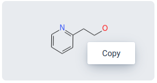
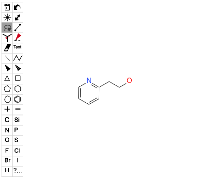

# OpenChemLib Vaadin 
[](https://github.com/artaius/openchemlib-vaadin/actions)
[](https://central.sonatype.com/artifact/ch.artaios/openchemlib-vaadin)

Vaadin Java integration of the [OpenChemLib JS](https://github.com/cheminfo/openchemlib-js) components ([OpenChemLib JS](https://github.com/cheminfo/openchemlib-js) is the JavaScript port of [OpenChemLib](https://github.com/Actelion/openchemlib)).




## Usage
Grab the precompiled jar file(s) from [Releases](https://github.com/artaius/openchemlib-vaadin/releases/latest) or
add the following dependency to your project:
```xml
<dependency>
    <groupId>ch.artaios</groupId>
    <artifactId>openchemlib-vaadin</artifactId>
    <version>1.0.1</version>
</dependency>
```

To be able to properly run in development mode, don't forget to add package ```ch.artaios``` to ```src/main/resources/application.properties``` like follows:
```properties
vaadin.whitelisted-packages = com.vaadin,org.vaadin,dev.hilla,ch.artaios
```

## Development
### Starting the test/demo server
1. Run `mvn jetty:run`.
2. Open http://localhost:8080 in the browser.

### Building the production version 
To build production version run:
```bash
mvn clean
mvn vaadin:clean-frontend
mvn install -Pproduction
```


## Working Notes

- Query features dialog is missing (fragment mode on, double-click on atom with lasso tool)

### OCL hacks
Following changes are directly applied to the node module sources in ```node_modules/openchemlib/lib/canvas_editor```!
To make those changes active in dev mode, delete ```src/main/bundles/dev.bundle``` initiate ```mvn clean``` & rerun the project.
**This also needs to be done in dependant projects!!!**

- Replace line 111 by
  ```
    #handleChange = (editorEventOnChange) => {
        if (editorEventOnChange.type == 'molecule') {
            console.warn('editor-changed');

            switch (this.mode) {
                case CanvasEditorElement.MODE.MOLECULE: {
                    this.idcode = this.getMolecule().getIDCode();
                    break;
                }
                case CanvasEditorElement.MODE.REACTION: {
                    this.idcode = ReactionEncoder.encode(this.getReaction());
                    break;
                }
                default:
                    throw new Error(`Mode ${this.mode} is not supported`);
            }
            this.dispatchEvent(new CustomEvent('idcode-changed', {detail: "idcode",}));
        }
    };
    _copy(){
      console.warn('copy');
      navigator.clipboard.writeText(this.idcode).then(r => console.warn('idcode copied'));
      // TODO handle other content types? see below.
    }
    _paste(){
      // TODO handle other content types?
      // for debugging: list available clipboard content
      navigator.clipboard.read().then(clipboardItems => {
          console.warn(clipboardItems.length + " clipboardItem");
          clipboardItems.forEach(item => {
              item.types.forEach(type => {
                  item.getType(type).then(value => value.text().then(text => console.warn("clipboardItem type: " + type + ": " + text)));
              })
          })
      });
      navigator.clipboard.readText().then(idcode => {
          // this.idcode = idcode;
          this.setAttribute('idcode', idcode);
          console.warn('idcode pasted');
      });
    }
  ```
  in ```node_modules/openchemlib/lib/canvas_editor/init/canvas_editor_element.js```

- **Belows code does not seem to be necessary anymore**  
  Comment line 42 (```shadowRoot.adoptedStyleSheets = [getEditorStylesheet()];```) in ```node_modules/openchemlib/lib/canvas_editor/create_editor.js```. 

