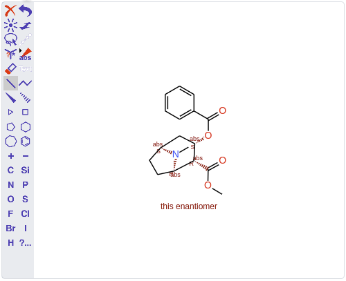
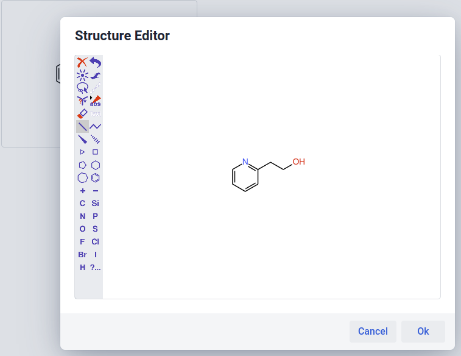
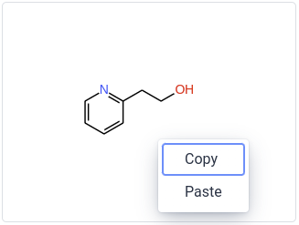
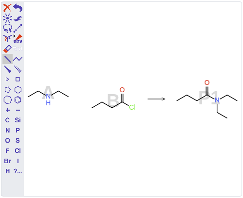

# OpenChemLib Vaadin 
[](https://github.com/artaius/openchemlib-vaadin/actions)
[](https://central.sonatype.com/artifact/ch.artaios/openchemlib-vaadin)

Vaadin Java integration of the [OpenChemLib JS](https://github.com/cheminfo/openchemlib-js) components ([OpenChemLib JS](https://github.com/cheminfo/openchemlib-js) is the JavaScript port of the [OpenChemLib](https://github.com/Actelion/openchemlib) Java library).

## Usage
Find it on [Vaadin addon directory](https://vaadin.com/directory/component/openchemlib-vaadin-components) or
or directly add the following dependency to your project:
```xml
<dependency>
    <groupId>ch.artaios</groupId>
    <artifactId>openchemlib-vaadin</artifactId>
    <version>X.X.X</version>
</dependency>
```
Additionally you can also grab the precompiled jar file(s) from [Releases](https://github.com/artaius/openchemlib-vaadin/releases/latest).

To be able to properly run in development mode, don't forget to add package ```ch.artaios``` to ```src/main/resources/application.properties``` like follows:
```properties
vaadin.whitelisted-packages = com.vaadin,org.vaadin,dev.hilla,ch.artaios
```

## Development
The project is based on SpringBoot.

### Starting the test server
The following allows to experiment with the components in the browser.
1. Run `ch.artaios.TestServer` in `src/test/java/ch/artaios/openchemlib/vaadin`.
2. Open https://localhost:8443 in the browser.

### Building 
To build production version run:
```bash
mvn install -Pproduction
```

## Screenshots




